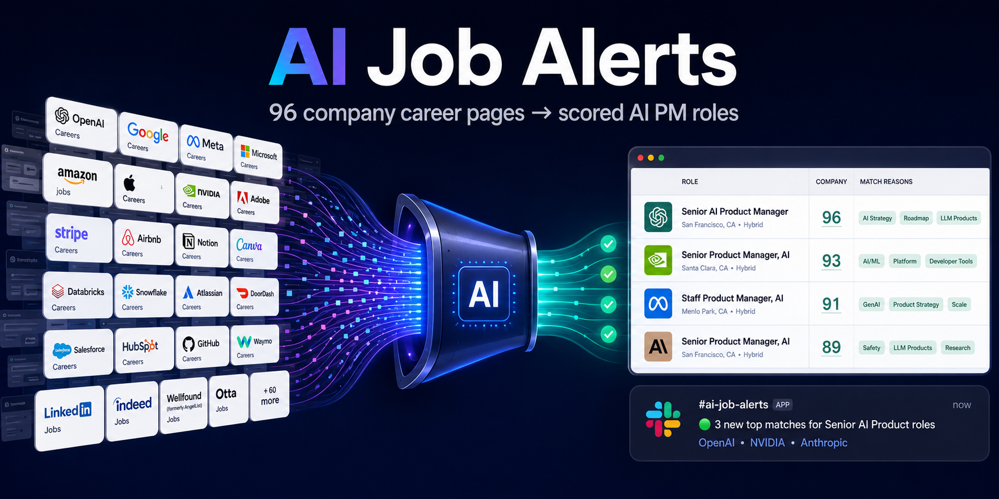
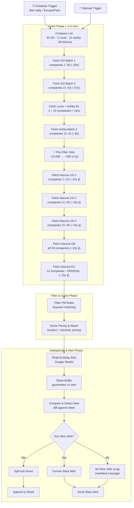

<p align="center">
  
</p>

# AI Job Alerts — Automated PM Role Monitor

> Daily automated scan of 96 company career pages for senior AI Product Management roles. Filters ~13,000 raw job postings down to scored, prioritised matches and delivers a Slack digest every morning.

---

## Stats

| Metric | Value |
| --- | --- |
| Companies monitored | 96 across 4 ATS platforms |
| ATS breakdown | 43 Greenhouse · 2 Lever · 21 Ashby · 30 Adzuna |
| Raw jobs fetched daily | ~13,000+ |
| After PM pre-filter | ~500 candidates |
| After full filter + scoring | varies (typically 10–60 matched roles) |
| Full execution time | ~4 minutes |
| Jobs logged (Google Sheet) | 800+ tracked since launch |

---

## What It Does

1. **Fetches** all open roles from 96 companies via their ATS APIs (Greenhouse, Lever, Ashby) and the Adzuna Jobs API for companies without a public ATS
2. **Filters** ~13,000 raw jobs through a two-stage keyword pipeline down to PM-relevant matches
3. **Scores** each match on location priority (EU/remote-EU = P1, US/remote-US = P2, on-site US/other = P3) and seniority/AI signal
4. **Deduplicates** against a Google Sheet log — only genuinely new roles trigger an alert
5. **Sends a Slack digest** with job details, match scores, and direct apply links; sends a heartbeat message on zero-new-job days

---

## Architecture

22-node n8n workflow. Fetch nodes accumulate state across sequential hops (n8n doesn't support parallel branches that merge). Filter and scoring run in a single pass each.



---

## Two-Stage Filtering

The pipeline uses two filter passes separated by the Adzuna fetch phase. This is a memory optimisation, not just a logic one.

### Stage 1 — Pre-Filter (before Adzuna fetch)

After all Greenhouse/Lever/Ashby jobs are accumulated (~10,000 jobs), a very permissive pre-filter runs:

```js
title.includes('product') || title.includes('cpo') ||
/\bpm\b/.test(title) || title.includes('gpm')
```

This reduces the in-memory job list from ~10,000 to ~500 **before** the Adzuna nodes run. Without this, the accumulated payload would exceed n8n Cloud's ~38MB memory limit by the end of the pipeline.

### Stage 2 — Full Filter PM Roles (after all fetches)

Multi-signal matching against the full job set:

```js
const isProductRole = PRODUCT_KEYWORDS.some(k => title.includes(k));
// e.g. 'product manager', 'head of product', 'vp product', 'cpo'

const isPMAbbrev = /\b(ai|ml|senior|sr|staff|principal|lead|group|head)\s+pm\b/.test(title);
// catches 'Senior PM', 'AI PM', 'Staff PM'

const isSenior = SENIOR_KEYWORDS.some(k => title.includes(k));
// head of / vp / director / staff / principal

const aiInTitle = AI_KEYWORDS.some(k => title.includes(k));
const aiInDesc  = (job.ai_in_desc || false) || AI_KEYWORDS.some(k => desc.includes(k));
// ai_in_desc is a pre-computed boolean flag (no description stored for GH Batch 1 + Adzuna)

const isMatch = (isProductRole || isPMAbbrev) && (isSenior || hasAISignal);
```

A role must be:
- A product role (by title pattern **or** PM abbreviation), **AND**
- Either senior-level **or** have an AI signal in the title/description

---

## Priority Scoring

Each matched role gets a `P1 / P2 / P3` priority and a `match_score` (50–100).

### Location Priority

| Priority | Condition |
| --- | --- |
| **P1** | Remote or hybrid + EU/UK/Israel location |
| **P1** | France-based (any work mode) |
| **P2** | Remote or hybrid + US location |
| **P2** | Remote with unspecified location (may be EU-eligible) |
| **P3** | Everything else |

### Match Score (50–100)

| Signal | Points |
| --- | --- |
| Base | 50 |
| Head of / VP / Director in title | +15 |
| Staff / Principal / Lead in title | +10 |
| AI keyword in title | +10 |
| AI keyword in description | +5 |
| Domain keywords in description | up to +20 |

Domain keywords include: `growth`, `plg`, `fintech`, `payments`, `saas`, `b2b`, `enterprise`, `platform`, `experimentation`, `a/b test`, `0 to 1`, `startup`, `mba`, and others.

---

## Key Engineering Decisions

### Why sequential fetch batches instead of one large node?

n8n Cloud kills Code nodes after **60 seconds**. Each ATS API call averages ~1.5s (up to ~4s under load), so each batch is sized to stay safely under the ceiling. The fetch phase is split into 8 nodes, each handling 2–21 companies.

### Why does GH Batch 1 pre-compute `ai_in_desc` instead of storing descriptions?

Greenhouse job descriptions average ~1,300 bytes each. With 41 companies × ~100 jobs each, storing full descriptions would add ~5MB per node pass. Instead, GH Batch 1 computes a boolean `ai_in_desc` flag from the description, then discards it — reducing per-job payload from ~1,300 bytes to ~300 bytes.

### Why is there a Sheet Buffer node?

n8n's Google Sheets node returns **0 items** when the sheet is empty. In n8n, 0 items from a node stops execution of all downstream nodes. The Sheet Buffer node injects a dummy `{}` item when the sheet is empty, ensuring the comparison node always runs.

### Why Adzuna for big tech?

Google, Meta, Microsoft, Apple, etc. don't expose a public ATS API. Adzuna's jobs search API allows filtering by company name, giving coverage for ~30 additional companies. The trade-off is lower precision (Adzuna results are noisier than direct ATS feeds) and a `what_or=product+growth+cpo` pre-filter at the API level.

---

## Setup

### Prerequisites

- [n8n](https://n8n.io) instance (cloud or self-hosted)
- [Adzuna API credentials](https://developer.adzuna.com) (free tier available)
- Google account with Sheets API enabled
- Slack workspace with an incoming webhook

### Environment Variables

Copy `.env.example` and fill in your values. In n8n Cloud, these are set as workflow-level variables or directly in node code.

| Variable | Description |
| --- | --- |
| `ADZUNA_APP_ID` | Adzuna API app ID |
| `ADZUNA_APP_KEY` | Adzuna API app key |
| `SLACK_WEBHOOK_URL` | Slack incoming webhook URL |
| `GOOGLE_SHEET_ID` | ID from your Google Sheet URL |

### Workflow Setup

1. Create a new n8n workflow and import each node's code from the `nodes/` directory in order
2. Connect nodes following the architecture diagram above
3. Set the Schedule Trigger to `0 8 * * *` (or your preferred time), timezone `Europe/Paris`
4. Add a Google Sheets OAuth2 credential and attach it to the "Read Existing Jobs" and "Append to Sheet" nodes
5. Create the Google Sheet with the headers listed below
6. Activate the workflow

### Google Sheet Headers (Row 1)

```
Job ID | Company | Title | Location | Remote Policy | Priority | Priority Reason |
Date First Seen | Date Posted | Job URL | ATS | Status | Match Score |
AI Keywords | Department | Compensation | Notes
```

---

## Node Reference

| # | Node | Type | Purpose |
| --- | --- | --- | --- |
| 1 | Schedule Trigger | Trigger | 8am daily |
| 2 | Manual Trigger | Trigger | On-demand testing |
| 3 | Company List | Code | Outputs 4 arrays: greenhouse / lever / ashby / adzuna |
| 4 | Fetch GH Batch 1 | Code | Greenhouse companies 1–20, pre-computes `ai_in_desc` |
| 5 | Fetch GH Batch 2 | Code | Greenhouse companies 21–43 |
| 6 | Fetch Lever + Ashby B1 | Code | Lever (2) + Ashby (1–10) |
| 7 | Fetch Ashby Batch 2 | Code | Ashby (11–21) |
| 8 | Pre-Filter Jobs | Code | Memory firewall: ~10k → ~500 |
| 9 | Fetch Adzuna US-1 | Code | Adzuna companies 1–10, US only |
| 10 | Fetch Adzuna US-2 | Code | Adzuna companies 11–20, US only |
| 11 | Fetch Adzuna US-3 | Code | Adzuna companies 21–30, US only |
| 12 | Fetch Adzuna GB | Code | All 30 Adzuna companies, GB only |
| 13 | Fetch Adzuna EU | Code | 12 EU-relevant companies, FR/DE/NL |
| 14 | Filter PM Roles | Code | Full keyword matching |
| 15 | Score Priority & Match | Code | Location priority + match score |
| 16 | Read Existing Jobs | Google Sheets | Reads Sheet1 |
| 17 | Sheet Buffer | Code | Guarantees ≥1 item for empty sheet |
| 18 | Compare & Detect New | Code | Diffs against sheet, builds alert payload |
| 19 | Any New Jobs? | IF | Routes to alert or heartbeat |
| 20 | Split into Rows | Code | One item per new job |
| 21 | Append to Sheet | Google Sheets | Writes new rows to Sheet1 |
| 22 | Format Slack Alert | Code | Builds Slack message |
| 23 | No New Jobs (Log) | Code | Builds heartbeat message |
| 24 | Send Slack Alert | HTTP Request | POST to Slack webhook |

---

## Stack

- [**n8n**](https://n8n.io) — workflow automation platform
- **Greenhouse / Lever / Ashby** — ATS platforms with public job board APIs (no auth required)
- [**Adzuna Jobs API**](https://developer.adzuna.com) — job search API covering companies without public ATS
- **Google Sheets** — deduplication log and job tracker
- **Slack Incoming Webhooks** — daily alert delivery

---

## Limitations & Known Gaps

- **Companies without any public API**: Canva, Midjourney, Hugging Face, Rippling, Weights & Biases, monday.com — not currently covered
- **Adzuna precision**: Adzuna results are noisier than direct ATS feeds; the title/description filter compensates, but some false positives reach the sheet
- **Description coverage**: GH Batch 1 and Adzuna jobs do not store full descriptions (for memory reasons). AI keyword detection on descriptions uses a pre-computed boolean flag for these sources
- **Adzuna overflow**: Companies with >100 results are capped at 100 (2 pages × 50). A `WARN:` entry is pushed to the errors array and surfaced in the Slack alert

---

## License

MIT
